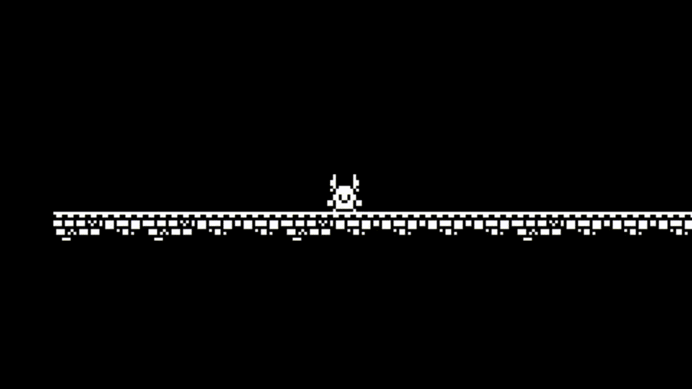

# Scenes

- Shows how to create `Scene`s and use `DrumSceneManager` in SGE.



## sge::Scene

A scene in SGE is basically a collection of contextually related entities (for example in a game level or a UI screen).

You can add entities to scene like this:

```C++
sge::Scene* level1 = new sge::Scene();
...
level1->addEntities(levelView, mapTileEntities); // Add an array of entities
level1->addEntity(levelView, coinEntity); // Add single entity
```

You also can simultaneously change the engine render state of *all* entities in the scene using these functions:

```C++
...
void activateSceneParts();
void pauseSceneParts();
void hideSceneParts();
...
```

## DrumSceneManager

A `DrumSceneManager` allows only one `sge::Scene` to be active at one point in time. This is useful for example for game level management.

The usage is simple:

- Create all needed `sge::Scene`s
- Register them in the manager:

```C++
universe->drumSceneManager->registerComponent("level1", level1);
universe->drumSceneManager->registerComponent("level2", level2);
```

- Set/Flip scenes when appropriate:

```C++
universe->drumSceneManager->setCurrentScene("level1");
```

**Note that if you won't set any current scene initially, nothing will be rendered to the screen.**

Also, when switching scene in `DrumSceneManager` ulike `LayerSceneManager`, the entities get recursively **deregistered** from the engine loop, meaning their pointers are removed from all corresponding managers, keep that in mind.