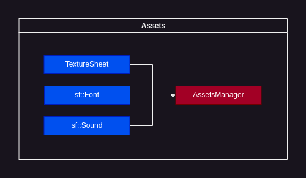

# Assets




"Assets" is a subsystem for centralized media resource management

## AssetsManager

### Usage examples:

Textures:

```C++
// Loading
universe->assetsManager->loadTextureSheet(
    std::filesystem::current_path().string() + "/tilemap.png",
    "tileset",
    sge::TextureSheetSizes{16, 16, 20, 20}
);

// Retrieving
sge::TextureSheet* ts = universe->assetsManager->getTextureSheet("tileset");
```


 
Fonts:

```C++
// Loading
universe->assetsManager->loadFont(
    std::filesystem::current_path().string() + "/font.ttf",
    "font"
);

// Retrieving
sf::Font* f = universe->assetsManager->getFont("font");
```

Sounds:

```C++
// Loading
universe->assetsManager->loadSFX(
    std::filesystem::current_path().string() + "/sfx.wav",
    "sword_swing"
);

// Retrieving
sf::Sound* s = universe->assetsManager->getSound("sword_swing");
```

Music:

Because of the specificity of [sf::Music](https://www.sfml-dev.org/documentation/2.5.1/classsf_1_1Music.php) class, it can not be stored directly in the manager, so, for convenience, `AssetsManager` allows you to specify paths to audio files which you can utilize to load music using `sf::Music` object.

```C++
// Specifying location
assetsManager->specifyMusicLocation(
    std::filesystem::current_path().string() + "/music.wav",
    "battle_music"
);

// Retrieving
std::string loc = assetsManager->getMusicLocation("battle_music");

// Using with sf::Music (see SFML documentation)
sf::Music* music = new sf::Music();
music->openFromFile(loc);
music->play();
```

## TextureSheet

`TextureSheet` is a class that describes a particular texture sheet.

It is constructed by loading a texture file from specified location. Then, an array of [sf::IntRect](https://www.sfml-dev.org/documentation/2.5.1/classsf_1_1Rect.php) is created using given `TextureSheetSizes` values. Each `sf::IntRect` covers a specific texture in the texture sheet.

Given all that, setting [sf::Sprite](https://www.sfml-dev.org/documentation/2.5.1/classsf_1_1Sprite.php) textures is as easy as:

```C++
// Loading and retrieving sge::TextureSheet
sge::TextureSheet* ts = universe->assetsManager->getTextureSheet("tileset");

// Creating sf::Sprite and setting it's texture and texture rect
sf::Sprite* sprite = new sf::Sprite();
sprite.setTexture(*ts->getTexture());
sprite.setTextureRect(ts->getTextureRect(10)); // 10 is a left-to-right, top-to-bottom number of texture in texture sheet starting at zero
```
## TextureSheetSizes

`TextureSheetSizes` is simply a structure for convenient specifying of single texture dimensions:

```C++
struct TextureSheetSizes{
    int textureSizeX;
    int textureSizeY;
    int numTexturesX;
    int numTexturesY;
    int gapX = 0;
    int gapY = 0;
};
```

You pass it to `loadTextureSheet` function as follows:

```C++
universe->assetsManager->loadTextureSheet(
    std::filesystem::current_path().string() + "/tilemap.png",
    "tileset",
    sge::TextureSheetSizes{16, 16, 20, 20}
);
```