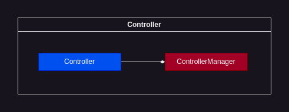

# Controller



"Controller" is a subsystem for controller management

## ControllerManager

### Usage examples:

Registering new controller:

```C++
universe->controllerManager->registerComponent(new KeyboardController(playerEntity));
```

## Controller

A class used to describe a particular controller.

`Controller` defines a virtual function called `script` which you must override to successfully create a controller. For example:

```C++
class KeyboardController : public sge::Controller{
    public:
        // playerEntity is additionally passed to KeyboardController constructor
        // because it's the object that will be manipulated using keyboard keys
        KeyboardController(sge::Entity* playerEntity) : m_playerEntityPtr(playerEntity){}; 

        void script(sf::Event event) override{
            if(event.type == sf::Event::KeyPressed){
                if(event.key.code == sf::Keyboard::A){
                    // Move left
                }
                else if(event.key.code == sf::Keyboard::D){
                    // Move right
                }

                if(event.key.code == sf::Keyboard::Space){
                    // Jump
                }
            }
            if(event.type == sf::Event::KeyReleased){
                if(event.key.code == sf::Keyboard::A){
                    // Stop moving left                    
                }
                if(event.key.code == sf::Keyboard::D){
                    // Stop moving right                    
                }
            }
        }

    private:
        sge::Entity* m_playerEntityPtr;
};
```

The `script` function receives [sf::Event](https://www.sfml-dev.org/documentation/2.5.1/classsf_1_1Event.php) object which you can use to write processing code.

The `script` function will be called every `Universe` main loop iteration.

<br>

You should register your custom controller with overriden script as follows:

```C++
universe->controllerManager->registerComponent(new KeyboardController(playerEntity));
```