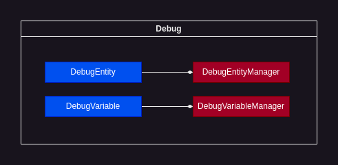
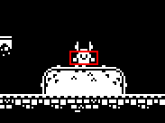
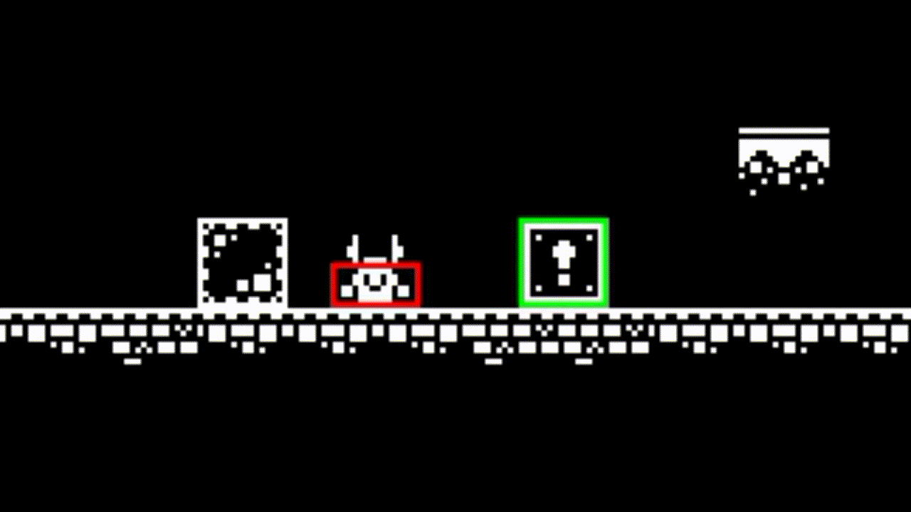

# Debug



"Debug" is a subsystem created to ease debugging

<br>

## DebugEntityManager

### Setup:

To use `DebugEntityManager` you must first set it up in the `Universe` object as follows:

```C++
universe->setupDebugEntityManager(); // ! call before universe->loop();
```

### Usage examples:

Registering `DebugEntity`:

```C++
universe->debugEntityManager->registerComponent(view, debugEntity);
```

`DebugEntityManager` is a `ViewManager`, that means it requires you to specify the [sf::View]() in which the debugEntity will be drawn.

<br>

## DebugEntity

`DebugEntity` is a class that's used to debug a specific `Entity` 

### Usage examples:

With `DebugEntity` you can draw the border around `Entity`'s collision shapes. To do that, you simply create a new object:

```C++
sge::DebugEntity* de = new sge::DebugEntity(entityObject);
```

You should register your `DebugEntity` as follows:

```C++
universe->debugEntityManager->registerComponent(view, de);
```

The result could look like this:



<br>

## CollisionShapeBorder & CollisionShapeBorderSettings

`CollisionShapeBorder` class is used to generate the border around the specific `CollisionShape` based on `CollisionShapeBorderSettings`.

`CollisionShapeBorderSettings` can be programmatically conditionally changed, which means you can create effects like collision highlighting:



(see `/examples`)