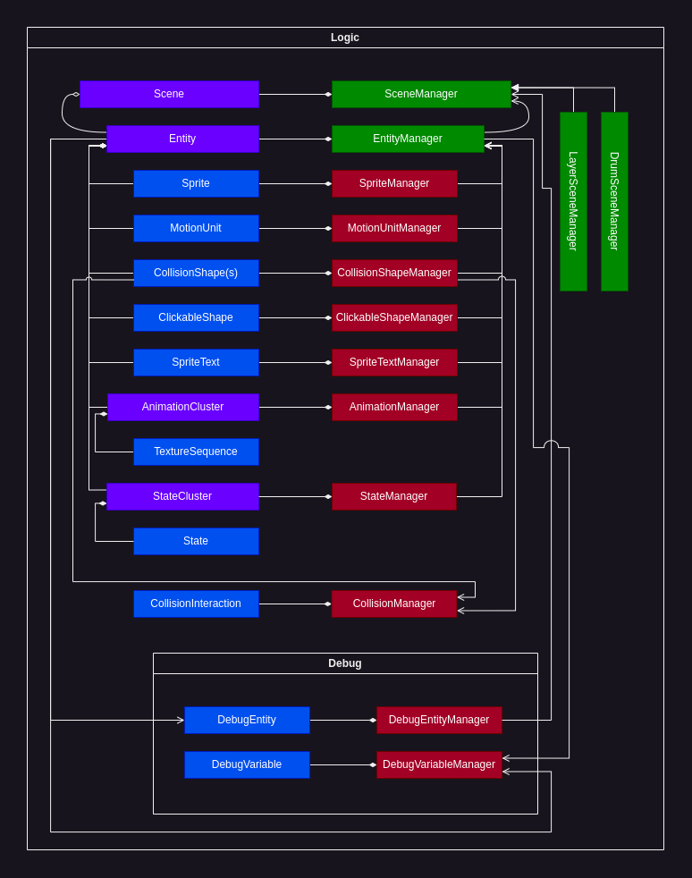

# Logic

"Logic" defines the main logic of the game engine.

 

## Key ideas

### Entity

The main idea of the game engine is that everything on the screen is an `Entity`.

`Entity`, based on the components it *contains* can describe anything from the player object to certain UI elements.

 

`Entity` must contain `sge::Sprite`.

`Entity` can contain components like: `MotionUnit`, one or many `CollisionShape` objects, `ClickableShape`, `SpriteText`, `AnimationCluster` and `StateCluster`.

 

For example.

A player `Entity` object could contain `Sprite`, `MotionUnit`, `CollisionShape`, `AnimationCluster` and possibly a `StateCluster`.

A button `Entity` could contain only as much as a `Sprite` and `ClickableShape`.

 

This concept gives the engine a lot of flexibility while keeping the structure simple to use and understand.

 

### Scene

A `Scene` is basically a container for Entities. Using scenes you can group related entities (for example in levels or screens) and conveniently manage them together.

Further descriptions are written in sub directories.

 

### Physics

To code physics using SGE you must use the `Entity` object that contains the `Sprite` and `MotionUnit`.

`MotionUnit` contains certain physical properties that can be used in computation functions.

 

### Collisions

SGE defines the concept of collision "interaction".

An interaction describes a set of actions that must be performed when objects in specified "collision groups" collide.

The actions can be defined based on "collision phase" (start, continuous or end).

 

### Complex physics

The combination of collision interactions and `MotionUnit` calculations allow to simulate more complex physical concepts like "kinetic friction", "bounce" etc. (see `/examples`)

 
 

In depth documentation about each "Logic" concept can be found in subdirectories.