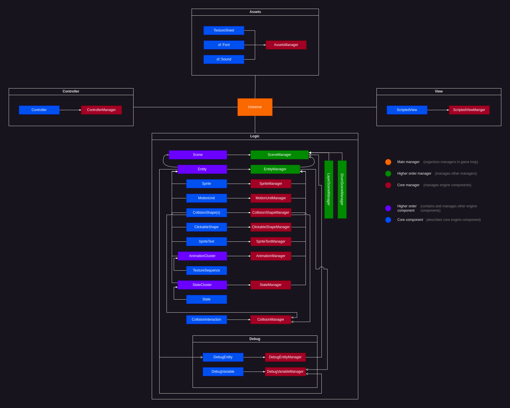
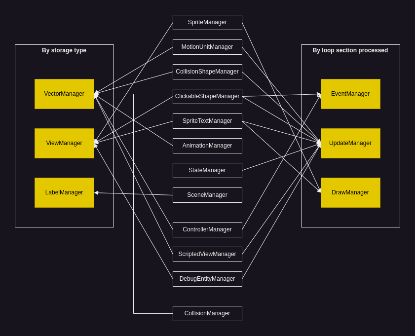

# Structure and concepts

As you can see in the above diagram, the engine is *logically* divided into 5 blocks:
- **Assets** - for media resource management
- **Controller** - for input device management and scripting
- **View** - for view scripting
- **Logic** - main engine logic
- **Debug** - debug functionality

 

Simple Game Engine implements the Component-Manager architecture, where:

 

## Component

The component's purpose is to describe some concrete portion of functionality. For example, `MotionUnit` describes physical motion algorithms and computation that a particular `Entity` has, `AnimationCluster` deals with object's animations etc.

Components, at any point in time, are in one of three "states": `active`, `paused` or `hidden`. The state of the component influences in what way or to what degree it's being processed by the engine in the main loop. This diagram describes it well:

This functionality allows to "pause" or "hide" objects and scenes with ease.

 

## Manager

The manager's purpose is to 'manage' (register, deregister, store) and process components.

Some managers, for refactoring purposes and for logical purposes, are divided into the following types:

This allows to clearly distinguish what each manager does and save a couple lines of implementation code.

 

Suggested next step: learn about [Universe](../Universe/README.md).