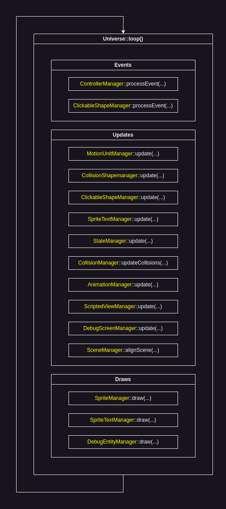

# Universe

"Universe" is the main engine class that organizes all functionality in the main engine loop.

The order of processing in the main loop can be illustrated as follows:



<br>

### Initialization:

To use the game engine you should initialize the `Universe` object which in turn will initialize all of the engine managers which then can be used for your game creation purposes.

`Universe` requires you to initialize and pass it the [sf::RenderWindow](https://www.sfml-dev.org/documentation/2.5.1/classsf_1_1RenderWindow.php).

The global program sctructure would look like this:

```C++
int main(){
    sf::RenderWindow* window = new sf::RenderWindow(sf::VideoMode(1000, 600), "Test");

    sge::Universe* universe = new sge::Universe(window);

    // Your game code

    universe->loop(); // Starting the universe loop

    return 0;
}
```

<br>

### Debug functionality:

If you wish to use the debug functionality of the engine, there are extra initialization steps that you must perform.

Debug functionality is not automatically initialized for optimization reasons. Why, by default, process the functionality that will not be present in the final product?

<br>

So with `DebugEntity` functionality initialized, your program structure would be:

```C++
int main(){
    sf::RenderWindow* window = new sf::RenderWindow(sf::VideoMode(1000, 600), "Test");

    sge::Universe* universe = new sge::Universe(window);
    universe->setupDebugEntityManager(); // Setting up DEM

    // Your game code

    universe->loop();

    return 0;
}
```

Initializing `DebugVariable` takes a bit more lines:

```C++
int main(){
    sf::RenderWindow* window = new sf::RenderWindow(sf::VideoMode(1000, 600), "Test");
    // DebugScreenManager requires a sf::View to draw DebugVariables
    sf::View v = window->getDefaultView();
    sf::View* debugScreenView = &v;
    //

    sge::Universe* universe = new sge::Universe(window);

    // DebugScreenManager requires a sf::Font to create sge::Entities
    universe->assetsManager->loadFont(
        std::filesystem::current_path().string() + "/examples/dev/assets/m5x7.ttf",
        "m5x7"
    );
    //

    universe->setupDebugScreenManager(debugScreenView, universe->assetsManager->getFont("m5x7"), 30); // Setting up DSM

    // Your game code

    universe->loop();

    return 0;
}
```

Obviously you can setup and use both debug managers at the same time.