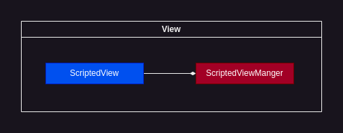

# View



"View" a subsystem for view script management

## ScriptedViewManager

### Usage examples:

Registering new ScriptedView:

```C++
universe->scriptedViewManager->registerComponent(cameraView);
```

## ScriptedView

A class used to add scripts to [sf::View](https://www.sfml-dev.org/documentation/2.5.1/classsf_1_1View.php) in an organized way.

`ScriptedView` defines a virtual function called `script` which you must override to successfully add a script to `sf::View` . For example:

```C++
class CameraView : public sge::ScriptedView{
    public:
        CameraView(sge::Entity* playerEntity) : m_playerEntityPtr(playerEntity){
            this->setCenter(sf::Vector2f(100, 100));
            this->setSize(sf::Vector2f(500, 300));
        };

        void script() override{
            sf::Vector2f center = m_playerEntityPtr->sprite->getPosition();
            center.x += 8;
            center.y += 8;

            m_scroll.x = center.x - this->getCenter().x - m_scroll.x / 100;
            m_scroll.y = center.y - this->getCenter().y - m_scroll.y / 100;
            
            this->setCenter(center - m_scroll);
        }

    private:
        sf::Vector2f m_scroll = sf::Vector2f(0, 0);
        sge::Entity* m_playerEntityPtr;
};
```

The `script` function will be called every `Universe` main loop iteration.

<br>

You should register your custom `ScriptedView` with overriden script as follows:

```C++
universe->scriptedViewManager->registerComponent(new CameraView(playerEntity));
```

<br>

The `CameraView` script above will smoothly follow the `playerEntity`:

